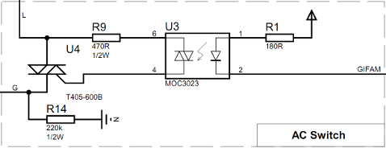

#Gifam Chip
__Gifam chip__ permet la commande d'un radiateur électrique équipé d'un fil pilote à l'aide d'un microcontroleur ATMEL AVR [attiny45](http://www.atmel.com/devices/attiny45.aspx) à 8 broches.

Le microcontroleur __attiny45__ reçoit ses ordres par l'intermédiaire d'un bus I²C. Il peut être alimenté entre 2,7 et 5,5 V ce qui lui permet d'être commandé par n'importe quel système équipé d'un bus I²C sur cette plage de tension (Raspberry Pi, Arduino ...). La vitesse d'horloge maximale est de 400 kHz.

Les sources du firmware du microcontroleur __attiny45__ sont publiées sous licence open source.

##Interface matérielle

###Détection de zéro

###Alimentation capacitive sans transformateur

###Interrupteur commandé

##Interface I²C

##Example de programme
###AvrIO

###Arduino

###Raspberry Pi en C